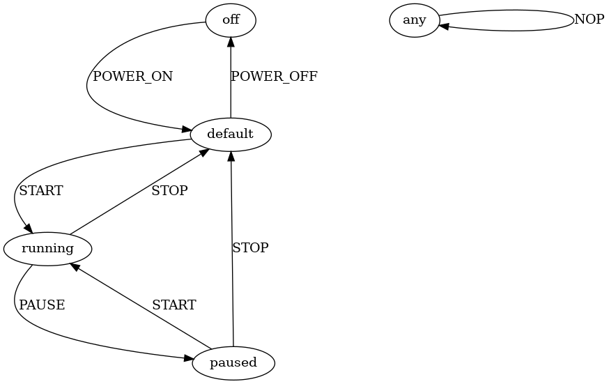

# Generating Semantic Parser

At its current state, parseLab can generate _syntax_ parsers based on a supplied protocol specification file.
In this guide, we will walk through how to go about modifying the generated parser and adding semantic (contextual) checks on top of the syntax checks.
This guide will use Hammer, the C parsing library, but the concepts translate to any other parsing backend.

# How to Add Semantic Parsing to a Generated Syntax Parser

For this guide, we will use a fictitious protocol "Machine Example Protocol", or MEP.

### MEP Message Format

| Field Name | Type | Value Constraint |
|------------|------|------------------|
| MESSAGE_ID | U8 | X |
| SOURCE_ID | U16 | ANY |
| TARGET_ID | U16 | ANY |

In our MEP protocol, there are six message types: `NOP`, `POWER_OFF`, `POWER_ON`, `START`, `STOP`, and `PAUSE`.


| Message | Message ID |
|---------|------------|
| NOP | 0 |
| POWER_OFF | 1 |
| POWER_ON | 2 |
| START | 3 |
| STOP | 4 |
| PAUSE | 5 |

## Starting with Syntax Validation

Here is what the NOP message looks like in the protocol specification file for the MEP protocol:

```json
{
    "name": "NOP",
    "fields": [
        {
            "name": "MESSAGE_ID",
            "type": "U8",
            "value": "0"
        },
        {
            "name": "SENDER_ID",
            "type": "U16"
        },
        {
            "name": "TARGET_ID",
            "type": "U16"
        }
    ]
}
```

The full protocol specification file for the MEP protocol can be found at [examples/semantic_conversion/syntax.json](../examples/semantic_conversion/syntax.json).

Since a successful semantic parser needs to also be capable of syntax parsing, it is important to start with the syntax component and then add in the semantic validation after.

## Adding Semantic Validation

We will use the following state machine to dictate our semantic rules:



To translate this state machine into something workable with parseLab, we will assign each state an ID.


| State | ID |
|-------|----|
| off | 0 |
| default | 1 |
| running | 2 |
| paused | 3 |

With states enumerated, we can then define valid state transitions for each message.
With the following table, we can see which messages are valid in which states, along with the state of the system after the message is processed.

| Message | Valid States | Next State |
|---------|--------------|------------|
| NOP | ANY | SAME |
| POWER_OFF | 1 | 0 |
| POWER_ON | 0 | 1 |
| START | 1 | 2 |
| STOP | 2 or 3 | 1 |
| PAUSE | 2 | 3 |

So now that we have established an initial condition for each of the messages, we can create a semantic validation for these conditions.
In other words, we can check the current state, and if we recieve a message that shouldn't be accepted in this state, we can drop it.

To do this, we will pass our current state index into the parser, and have the parser check the current state before it parses the message syntax.
The idea here is that we shouldn't need to waste cycles parsing the whole message if it doesn't make sense in this context anyway.

Since our state can be enumerated, we can actually create parse rules to validate the enumerated state just like we handle syntax.
And since we want to validate semantics before syntax, we will create semantic parse rules before our syntax parse rules.
To do this, we will edit the protocol specification to include the enumerated state validation.

Looking at the `STOP` message, we can see that the current state ID has to either be 2 or 3, meaning the `RUNNING` state or `PAUSED` state.
Modifying the protocol specification file for the STOP message would look like this:

```json
{
    "name": "STOP",
    "fields": [
        {
            "name": "VALID_STATES",
            "type": "U8",
            "value": "2|3"
        },
        {
            "name": "MESSAGE_ID",
            "type": "U8",
            "value": "4"
        },
        {
            "name": "SENDER_ID",
            "type": "U16"
        },
        {
            "name": "TARGET_ID",
            "type": "U16"
        }
    ]
}
```

As we can see in the `VALID_STATES` object, we are adding a parse rule for an `uint8_t` of value `2 or 3`.
Since we only have a handfull of states, we can keep the enumerated state data type small, so for this case it will only be a `uint8_t`, but it can really be any size.
Similarly, if multiple pieces of state need to be tracked, there can be multiple semantic checks preceeding the syntax checks.

The fully converted semantic protocol speicifcation file can be found at [examples/semantic_conversion/semantic.json](../examples/semantic_conversion/semantic.json).

# Generating Code

Now that we have established our protocol and our target state machine behaviour, we can start generating code.

We will want to setup a new protocol directory for this Machine Example, so we will start there.

```bash
# From parselab/bin
cd ${PARSELAB_TOP}/bin

# Setup a new protocol directory
./setup.py --module hammer --protocol ../protocols/mep

# Copy the completed semantic protocol specification
cp ../examples/semantic_conversion/semantic.json ../protocols/mep/protocol.json
```

With the protocol specification file ready, we can prepare to generate the parser.

In a [previous guide](./using_a_generated_parser.md) we worked with the `parse()` function; in this guide, we will manipulate it before generation.

Since we modifed the protocol specificaiton in a way that will generate a parser that consumes and processes an extra byte (the state) before processing the message's syntax, we need a way to pass that data into the parser.
This happens in the `parse()` function.

If we look at the parse function found at `protocols/mep/hammer/functions/parse.fun`, we will see the following code:

```c
int parse(const uint8_t* msg, int size) {
    size_t inputsize = size;
    uint8_t input[inputsize];

    memcpy(input, msg, inputsize);
    const HParser *parser = init_parser();
    HParseResult* result = h_parse(parser, input, inputsize);

    if (result != NULL) {
        return 0;
    }
    return 1;
}
```

We can see that there is no consideration for state, or prepending the `input` buffer with an extra byte of stateful information.

Before we modify this code, however, we are going to create a struct that contains our stateful information.
It may be a little overkill, since our stateful data is a single `uint8_t`, but for encapsulating it as a struct makes it easier to add more stateful data down the line if it is needed.

While using C Hammer, most the parser code gets generated without user input, but some of it can be modified by the user.
To do this, the `hammer/` directory in the protocol directory (`protocols/mep/hammer`) contains multiple subdirectories with information about how to generate the parser.
This is why the `parse()` function comes from the `mep/hammer/functions` subdirectory.

For a custom struct, we can put a `state_t.struct` file in the `hammer/objects` directory.
Files in the object directory will be scraped and placed into the `parser.h` file, so we are going to write the struct typedef for the `state_t` struct:

```c
typedef struct state_t {
    uint8_t state_id;
} state_t;
```

Lets add this struct file into the protocol directory with the existing file found at `examples/semantic_conversion/state_t.struct`:

```bash
cd ${PARSELAB_TOP}

cp ./examples/semantic_conversion/state_t.struct protocols/mep/hammer/objects/
```

Since our `parser.c` file includes the `parser.h` header, we can now assume that if we reference the `state_t` struct in `parse()`, it will compile properly.

So now, lets modify the `parse()` function to be stateful:


```c
int semantic_parse(const uint8_t* msg, int msg_length) {
    // Initialize a new STATIC instance of the state_t struct
    static struct state_t curr_state = {0};
    // Since we are going to pass the state data + message data to the parser
    //  we are going to need to modify the input size
    size_t input_size = msg_length + sizeof(curr_state);
    // Instead of creating an array on the stack, we will allocate memory
    uint8_t* input = (uint8_t*)malloc(input_size);

    // Place the state data at the front of the input buffer
    memcpy(input, &curr_state, sizeof(curr_state));
    // Place the message data after the state data
    memcpy(input + sizeof(curr_state), msg, msg_length);

    // Create the parser instance, and pass in a reference to the state data
    const HParser *parser = init_parser(&curr_state);
    HParseResult* result = h_parse(parser, input, input_size);

    // Free the allocated memory
    free(input);

    if (result != NULL) {
        return 0;
    }
    return 1;
}
```

Lets replace the `parse.fun` file with this new one.

```bash
cd ${PARSELAB_TOP}

cp examples/semantic_conversion/parse.fun protocols/mep/hammer/functions/parse.fun
```

At this point, we can now generate our parser.
It wont be complete just yet, so we will have to make some modifications to the generated code.

```bash
cd ${PARSELAB_TOP}/bin

# Generate the parser
./generate_parser.py --protocol ../protocols/mep --module hammer
```

If we look at `protocols/mep/hammer/out/src/parser.c` we will see that our `semantic_parse()` function has taken the place of the `parse()` function.

It is also important to note that the `semantic_parse()` function calls out to `init_parser()` with a `&curr_state` pointer, but the `init_parser()` function does not accept any inputs.

Lets modify that.

### OLD

```c
HParser *init_parser(void) {

}
```

### NEW

```c
HParser *init_parser(state_t *state_data) {

}
```

But now we need to actually use the `state_data`.
To do this, we are going to modify each of the `H_RULE` calls for the parsers that parse the top level messages.
These `H_RULE`s will be converted into `H_ADRULE`s.

The `A` in `H_ADRULE` stands for `action` and the `D` stands for `data`.
In Hammer, there are "semantic actions" that can be executed after hammer syntactically validates a piece of data.
We are going to leverage this to control the flow of state as the parser successfully parses our data.
These semantic actions are able to consume custom user data, if the parse rule is defined as a `H_ADRULE` (as opposed to a `H_ARULE` which does not consume data).
We are going to pass our `state_data` pointer to these semantic actions.

### OLD

```c
H_RULE(POWER_ON, 
      h_sequence(
        F_0__U8, 
        F_1__U8, 
        F_ANY_VALUE__U16, 
        F_ANY_VALUE__U16, 
        h_end_p(),
        NULL));
```


### NEW

```c
H_ADRULE(POWER_ON, 
      h_sequence(
        F_0__U8, 
        F_1__U8, 
        F_ANY_VALUE__U16, 
        F_ANY_VALUE__U16, 
        h_end_p(),
        NULL),
      state_data);
```

As we can see, it is as simple as adding `AD` to `H_RULE` along with adding the `state_data` as the last parameter to the `H_ADRULE` macro function.
Feel free to look at `glue.h` and `hammer.h` in the Hammer source code for more information about these macros.

**Go through and add the "AD" and state data to each of the message parse rules: POWER OFF, START, STOP, PAUSE**

Note that we will not need to convert `NOP` into an `H_ADRULE` since the `NOP` command will not change the state as it resembles a `no-operation` command.

At this point, all of the `H_ADRULE`s are setup properly, but no semantic actions will be executed after parsing successfully.
We need to establish the action callback for these `H_ADRULE` parse rules.
To do that, we need to create a set of new functions with the following convention:

```c
HParsedToken *act_{H_ADRULE NAME}(const HParseResult *p, void *user_data) {
    return (HParsedToken*)p->ast;
}
```

Meaning, for our `POWER_ON` parse rule, our semantic action callback will look like this:


```c
HParsedToken *act_POWER_ON(const HParseResult *p, void *user_data) {
    return (HParsedToken*)p->ast;
}
```

Now that we have the semantic action callback created, we can fill it out.
The `void *user_data` is how we access the data that we passed in as the last parameter of the `H_ADRULE` macro function.
Since our data is of type `state_t` we can cast it from the `void *` object:


```c
HParsedToken *act_POWER_ON(const HParseResult *p, void *user_data) {
    state_t *state_data = (state_t*)user_data;
    return (HParsedToken*)p->ast;
}
```

All the actions should look like this:

```c
HParsedToken *act_POWER_OFF(const HParseResult *p, void *user_data) {
    state_t *state_data = (state_t*)user_data;
    state_data->state_id = 0;
    return (HParsedToken*)p->ast;
}

HParsedToken *act_POWER_ON(const HParseResult *p, void *user_data) {
    state_t *state_data = (state_t*)user_data;
    state_data->state_id = 1;
    return (HParsedToken*)p->ast;
}

HParsedToken *act_START(const HParseResult *p, void *user_data) {
    state_t *state_data = (state_t*)user_data;
    state_data->state_id = 2;
    return (HParsedToken*)p->ast;
}

HParsedToken *act_STOP(const HParseResult *p, void *user_data) {
    state_t *state_data = (state_t*)user_data;
    state_data->state_id = 1;
    return (HParsedToken*)p->ast;
}

HParsedToken *act_PAUSE(const HParseResult *p, void *user_data) {
    state_t *state_data = (state_t*)user_data;
    state_data->state_id = 3;
    return (HParsedToken*)p->ast;
}
```


### Now that we have our data, what do we want to do with it?

Since our goal is to have our parser track state, we need to decide what state that the system will be in after each stateful message comes in.
Taking our `POWER_ON` message for example, the state that we want our machine to be in  (according to our state machine) is the `default` state, or `state_id = 1`.
Therefore, at this stage of the parser flow, we want to update the running state variable to reflect the new state:


```c
HParsedToken *act_POWER_ON(const HParseResult *p, void *user_data) {
    state_t *state_data = (state_t*)user_data;
    state_data->state_id = 1;
    return (HParsedToken*)p->ast;
}
```

Now, when this callback function gets executed, it means that the `state_data` will reflect that the current state (`state_id`) is `1` (or `default`).
Since the state is now `1`, the next time that the `semantic_parse()` function gets called, it will prepend the `input` buffer with this value and it will affect the set of valid messages.

Again, according to our state machine, we see that if we are in `state 1` (`default`) we can only accept `POWER_OFF` or `START` messages.
If we look at the parse rules for both of these messages, we can see that their state checks both contain a check for `1` before the syntax checks happen:

```c
H_ADRULE(POWER_OFF, 
      h_sequence(
        // STATE CHECK
        F_1__U8, 
        // SYNTAX CHECK
        F_2__U8, 
        F_ANY_VALUE__U16, 
        F_ANY_VALUE__U16, 
        h_end_p(),
        NULL),
      state_data);

H_ADRULE(START, 
      h_sequence(
        // STATE CHECK
        F_CHOICE__1__3__U8, 
        // SYNTAX CHECK
        F_3__U8, 
        F_ANY_VALUE__U16, 
        F_ANY_VALUE__U16, 
        h_end_p(),
        NULL),
      state_data);
```


At this point, we are now able to compile our parser and validate it against an [example process](../examples/semantic_conversion/machine.py).
This guide wont go through what `machine.py` is doing, since it isn't exactly relevant, but following the [guide for using a generated parser](./using_a_generated_parser.md) will give a better understanding of how `machine.py` leverages our generated parser.

This python script, `machine.py` simulates a `Controller` sending messages to a `Machine` using the `MEP` protocol that we have just defined.
The `Controller` sends 7 messages, in the following order:
 
1. POWER_ON
2. PAUSE
3. START
4. PAUSE
5. STOP
6. POWER_OFF
7. NOP

This sequence of messages is mostly conformant to the state machine that we defined, with the exception of the 2nd message: `PAUSE`.
If our parser was created correctly, running `machine.py` will show that every message is succesfully parsed except for the `PAUSE` message, which is not valid in the context that it gets passed into the parser.
Our state machine shows that `PAUSE` is not a valid message in the `default` state, which is what state the `Machine` should be in after receiving a `POWER_ON` message.

## Running the Semantic Parser

It is important that the files were named as defined in this guide for the following steps to work, so make sure to check spelling if errors appear.

First we need to compile our generated parser, then create a symlink to the built shared library file `parser.so`.

```bash
# Go to semantic_conversion example directory
cd ${PARSELAB_TOP}/examples/semantic_conversion

# Run the build script
./build.sh

# Make sure that libparser.so was created correctly
ls -la libparser.so
> ... ... ... libparser.so -> ../../protocols/mep/hammer/out/obj/parser.so
```

Now that we have a reference to the compiled shared library, we can use it in our `machine.py` script.

```bash
# Go to semantic_conversion example directory
cd ${PARSELAB_TOP}/examples/semantic_conversion

# Run machine.py
python3 machine.py --parse
> Controller: Sending POWER_ON
> Machine:      Recv: POWER_ON
> Machine:      New state: DEFAULT
> Controller: Sending PAUSE
> Machine:    DROPPING PACKET - PARSE FAILURE
> Controller: Sending START
> Machine:      Recv: START
> Machine:      New state: RUNNING
> Controller: Sending PAUSE
> Machine:      Recv: PAUSE
> Machine:      New state: PAUSED
> Controller: Sending STOP
> Machine:      Recv: STOP
> Machine:      New state: DEFAULT
> Controller: Sending POWER_OFF
> Machine:      Recv: POWER_OFF
> Machine:      New state: OFF
> Controller: Sending NOP
> Machine:      Recv: NOP
> Machine:      New state: OFF
```

We can see here that after sending the first `POWER_ON` message, the `Machine` accepts the message and updates the state accordingly.
Then, we see that the `Controller` sends a `PAUSE` message that gets dropped by the `Machine` because the machine detected that it received the message in the wrong state.
After dropping that message, the `Machine` then receives a `START` message which is valid, and continues on correctly as it iterates through the state machine.

To show the impact of our parser, we can also run the `machine.py` script without the `--parse` paramter, which will tell the `Machine` that it shouldn't attempt to validate any messages.
Without message validation, the `Machine` will accept all messages, even if it doesn't make sense according to the state machine.


```bash
# Go to semantic_conversion example directory
cd ${PARSELAB_TOP}/examples/semantic_conversion

# Run machine.py
python3 machine.py
> Controller: Sending POWER_ON
> Machine:      Recv: POWER_ON
> Machine:      New state: DEFAULT
> Controller: Sending PAUSE
> Machine:      Recv: PAUSE
> Machine:      New state: PAUSED
> Controller: Sending START
> Machine:      Recv: START
> Machine:      New state: RUNNING
> Controller: Sending PAUSE
> Machine:      Recv: PAUSE
> Machine:      New state: PAUSED
> Controller: Sending STOP
> Machine:      Recv: STOP
> Machine:      New state: DEFAULT
> Controller: Sending POWER_OFF
> Machine:      Recv: POWER_OFF
> Machine:      New state: OFF
> Controller: Sending NOP
> Machine:      Recv: NOP
> Machine:      New state: OFF
```

Here, we can see that the `Machine` accepts the `PAUSE` message, even though it doesn't adhere to the state machine specification.
In this small example, there are no repercussions for our `Machine` not conforming to our state machine, but it can be easy to imagine a real system having real negative implications if this were to happen.

# Conclusion

At this point, the syntax to semantic conversion process is done for our `MEP` protocol example.
Although this example is fairly trivial, it can be easily expanded for more complicated state transitions and state tracking.
